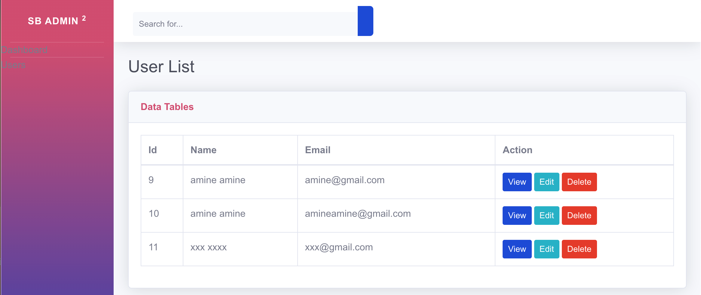

# UserXplore Documentation

## Overview

UserXplore is a user management system built with Next.js, Prisma, and SQLite. It provides an interactive interface for administrators to manage user information effectively. The application includes a registration page for new users and an admin dashboard that allows for viewing, updating, and deleting user data.

---
## Table of Contents

- [Features](#features)
- [Technologies](#technologies)
- [Installation](#installation)
- [Usage](#usage)
- [API Endpoints](#api-endpoints)

---

## Features

- **Registration Page**:
- **Admin Dashboard**: 
  - **User Management**: 
    - View user details.
    - Update user information.
    - Delete users from the database.
  - **Dashboard Overview**: A summary of user statistics and management actions.
- **API Integration**: All operations are performed through API endpoints using Next.js.

## Technologies

- **Next.js**: A React framework for building server-rendered applications and API routes.
- **Prisma**: An ORM for seamless data management and communication with the SQLite database.
- **SQLite**: A lightweight, serverless database for storing user data.

---

## Installation

1. **Clone the repository:**

   ```bash
   git clone https://github.com/amineelhassak/UserXplore
   cd UserXplore
   npm install
  ``
## Usage
npm run dev
Once the application is running, you can access the user management features via the following URL:

- **User Management**: [http://localhost:3000/admin/users](http://localhost:3000/admin/users)

You can create, read, update, delete, and search for users through the provided user interface.
terminal:
  open http://localhost:3000/register
  open http://localhost:3000/admin/users

## API Endpoints

The application provides the following API endpoints for user management:

- **GET** `/api/users` - Retrieve a list of all users
- **POST** `/api/users` - Create a new user
- **GET** `/api/users/:id` - Retrieve a specific user by ID
- **PUT** `/api/users/:id` - Update a specific user by ID
- **DELETE** `/api/users/:id` - Delete a specific user by ID


- page Register


- Users


- User view


- User Edit

